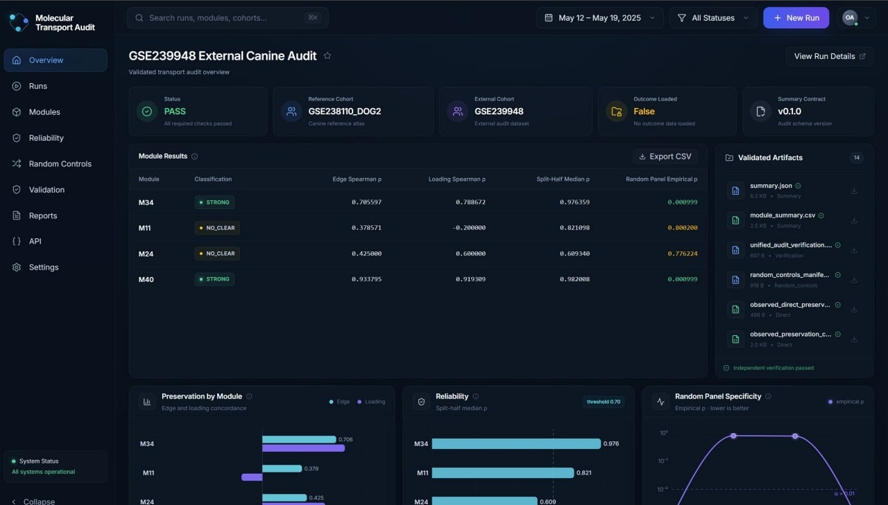

# Molecular Transport Audit

**A reproducible research-software framework for testing whether frozen molecular programs preserve their biological representation, specificity, reliability, and clinical transport across datasets.**


<p align="center">
  
</p>

<p align="center">
  
</p>

---

<p align="center">
  <a href="https://youtu.be/kCSqZ3QDH-U">
    
  </a>
</p>

<p align="center">
  <strong>▶ Watch the end-to-end demo</strong>
</p>


## Why this project exists

Cross-cohort and cross-species biomarker studies often treat replication of a clinical association as evidence that the underlying molecular program has transferred successfully.

Those are different questions.

A frozen molecular program may:

- remain structurally recognizable while losing its clinical association;
- retain a clinical association despite weak structural representation;
- recur independently in an unsupervised analysis;
- be sensitive to assay or preprocessing choices;
- fail to outperform appropriately matched random controls.

**Molecular Transport Audit separates these questions instead of collapsing them into a single replication criterion.**

The project originates from a comparative canine-to-human osteosarcoma study. The original study remains the scientific source of truth; this repository generalizes the computational audit into reusable research software while preserving frozen scientific results and provenance.

---

## Current reference implementation

The current locked validation case audits molecular representation preservation from the DOG² canine osteosarcoma reference cohort into the independent GSE239948 canine cohort.

| Component | Reference case |
|---|---|
| Reference cohort | `GSE238110_DOG2` |
| External cohort | `GSE239948` |
| Frozen programs | `M34`, `M11`, `M24`, `M40` |
| Outcome data loaded | `false` |
| Permutation tests | 5,000 per test |
| Split-half repeats | 2,000 |
| Matched random panels | 1,000 |
| Random-control matching | pre-standardization variability |
| Summary contract | `v0.1.0` |

### Locked external-canine result

| Module | Edge Spearman ρ | Loading Spearman ρ | Split-half median ρ | Random-panel empirical p | Classification |
|---|---:|---:|---:|---:|---|
| M34 | 0.705597 | 0.788672 | 0.976359 | 0.000999 | **strong** |
| M11 | 0.378571 | -0.200000 | 0.821098 | 0.800200 | **no clear preservation** |
| M24 | 0.425000 | 0.600000 | 0.609340 | 0.776224 | **no clear preservation** |
| M40 | 0.933795 | 0.919309 | 0.982008 | 0.000999 | **strong** |

These results are reproduced by the unified Docker + Nextflow validation workflow and independently checked before the UI-facing summary is accepted.

---

## Audit dimensions

The framework is organized around five primary dimensions.

### 1. Predictive specificity

Tests whether a selected molecular representation provides evidence beyond appropriately matched random controls.

### 2. Molecular representation preservation

Evaluates whether the internal structure of a frozen molecular program is preserved in a target dataset using measures such as edge concordance, loading concordance, coverage, and reliability.

### 3. Unsupervised recurrence

Tests whether a frozen program can recur without forcing the target data to reproduce it, including blind module-rediscovery and latent-factor analyses.

### 4. Clinical outcome transport

Evaluates frozen scores and directions in target cohorts without outcome-driven re-selection, re-weighting, or re-orientation.

### 5. Measurement robustness

Evaluates whether conclusions remain stable across predefined, outcome-blind assay or measurement-processing rules.

Multiplicity control, provenance, stochastic-policy tracking, and scientific locks are treated as cross-cutting requirements.

---

## What is implemented

### Scientific execution layer

- reusable Python scientific core;
- direct molecular-preservation metrics;
- permutation-based inference;
- split-half reliability;
- gene leave-one-out diagnostics;
- variability-matched random-panel controls;
- empirical p-values with explicit stochastic policies;
- external-representation classification;
- regression tests against frozen reference outputs;
- independent verification of unified results.

### Reproducible workflow layer

- Dockerized scientific execution;
- Nextflow DSL2 orchestration;
- versioned configuration;
- machine-readable manifests and hashes;
- deterministic reference fixtures;
- stable `summary.json` UI/API contract;
- outcome-blind execution guardrails.

### Application layer

The repository is also being developed as an interactive research-software application:

- FastAPI service for validated runs and summaries;
- persistent run registry;
- run-state and pipeline-stage reporting;
- validated artifact access;
- React + TypeScript dashboard;
- interactive module-level visualizations;
- live pipeline progress and run-launch UI.

The scientific core is intentionally independent of the web application.

---

## Architecture

```text
React + TypeScript dashboard
            |
            v
        FastAPI
            |
            v
   managed run orchestration
            |
            v
      Nextflow DSL2
            |
            +-----------------------------+
            |                             |
            v                             v
  Python scientific core          workflow adapters
            |
            v
   validated result bundle
            |
            +-- direct preservation
            +-- permutation inference
            +-- reliability + LOO
            +-- random controls
            +-- manifests
            +-- module_summary.csv
            +-- summary.json
            +-- independent verification
```

The reusable scientific implementation does not depend on React or FastAPI. The same locked workflow can be executed from the command line without the UI.

For design details, see [ARCHITECTURE.md](ARCHITECTURE.md).

---

## Unified validation workflow

The complete locked GSE239948 audit can be executed through the validation runner:

```bash
python tools/run_unified_audit_validation.py
```

The runner:

1. rebuilds the scientific Docker image;
2. validates the Docker / WSL / Nextflow environment;
3. runs the complete Nextflow workflow;
4. executes preservation, inference, reliability, random controls, summary assembly, and verification;
5. publishes a stable result bundle;
6. fails if the independent verifier does not pass.

A successful run ends with:

```text
Unified molecular transport audit: PASS
Reference cohort: GSE238110_DOG2
External cohort: GSE239948
Outcome loaded: False
Summary contract: v0.1.0
```

---

## Running the API

Install the API package:

```bash
python -m pip install -e ./api
```

Start the development server:

```bash
python -m uvicorn mta_api.main:app --reload --host 127.0.0.1 --port 8000
```

Useful endpoints include:

```text
GET  /health
GET  /runs
GET  /runs/{run_id}
GET  /runs/{run_id}/summary
GET  /runs/{run_id}/artifacts
GET  /runs/{run_id}/log
POST /runs
```

Interactive API documentation is available from the running FastAPI service at `/docs`.

---

## Running the frontend

The dashboard is built with React, TypeScript, Vite, Tailwind CSS, Lucide, and Recharts.

```bash
cd frontend
npm install
npm run dev
```

The development UI is then available at:

```text
http://localhost:5173
```

During local development, Vite proxies `/api/*` requests to the FastAPI service.

---

## Result contract

The unified audit publishes a versioned result bundle.

```text
reports/
└── unified_audit_validation/
    ├── direct/
    ├── inference/
    ├── reliability/
    ├── random_controls/
    ├── summary/
    │   ├── module_summary.csv
    │   └── summary.json
    ├── verification/
    │   └── unified_audit_verification.json
    └── unified_audit_validation_manifest.json
```

`summary.json` is the stable application-facing contract. Scientific result generation remains upstream of the API and UI.

---

## Scientific reproducibility principles

The project follows several non-negotiable constraints:

- scientific conclusions from the source study are frozen;
- target outcomes must not be used to redefine frozen molecular programs;
- reusable implementations must reproduce locked reference analyses before replacing legacy code;
- stochastic analyses require explicitly documented seeds, schedules, sampling rules, and empirical-p definitions;
- provenance must be machine-readable;
- dataset-specific preprocessing remains separate from reusable computational logic;
- historical numerical behavior is preserved where required for regression, while corrected sensitivity analyses are explicitly separated from legacy behavior.

See [SCIENCE_LOCK.md](SCIENCE_LOCK.md) for the complete scientific guardrails.

---

## Repository structure

```text
molecular-transport-audit/
├── api/                    # FastAPI application
├── configs/                # Versioned audit configuration
├── core/                   # Reusable scientific Python package
├── frontend/               # React + TypeScript dashboard
├── reference_results/      # Frozen regression fixtures and reference artifacts
├── reports/                # Validation and application run outputs
├── tests/                  # Scientific regression and unit tests
├── tools/                  # Validation and orchestration runners
└── workflow/               # Nextflow DSL2 workflow and adapters
```

---

## Source study and provenance

The project originates from the osteosarcoma analysis maintained separately in:

**[Helen2813/paper4_sarcoma_dog](https://github.com/Helen2813/paper4_sarcoma_dog)**

That repository contains historical analysis scripts, frozen study outputs, dataset-specific preprocessing, and manuscript-specific analyses.

This repository contains the reusable audit implementation.

Reference artifacts are accompanied by provenance metadata where available, including source script/version, hashes, scientific-lock state, configuration, and execution metadata.

---

## Documentation

- [Scientific lock](SCIENCE_LOCK.md)
- [Software architecture](ARCHITECTURE.md)
- [Development plan](PLAN.md)

---

## Scope

Molecular Transport Audit focuses on **auditing frozen molecular programs**.

It is not intended to be a general multimodal representation-learning framework. New multimodal methods, spatial multi-omics, cross-modal neural representation learning, and unrelated omics integration are intentionally outside the current scope.

---

## Development status

The scientific GSE239948 reference pipeline has reached a reproducible unified validation stage.

The FastAPI and React application layers are under active development on top of the locked scientific contract.

---

## License

A software license will be selected before the first versioned public research release.

## Citation

Citation information will be added with the first versioned research release.
